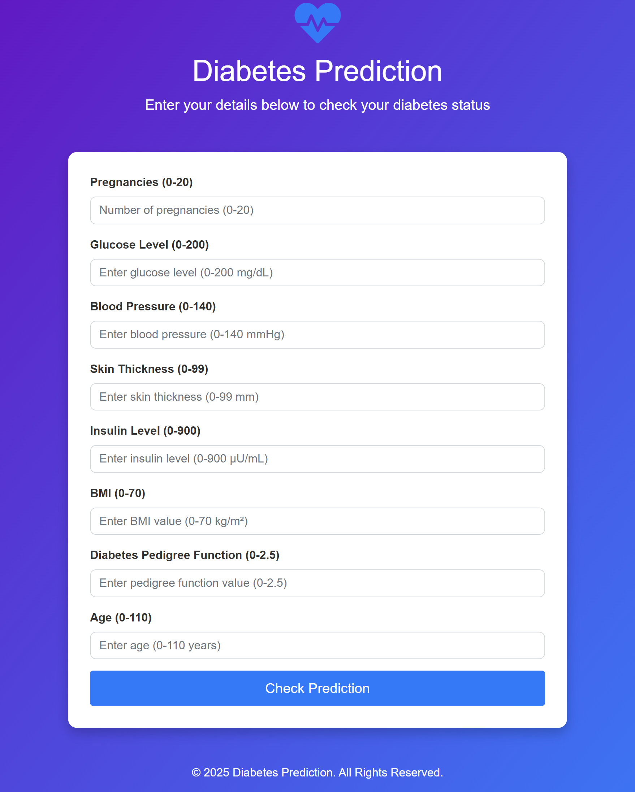
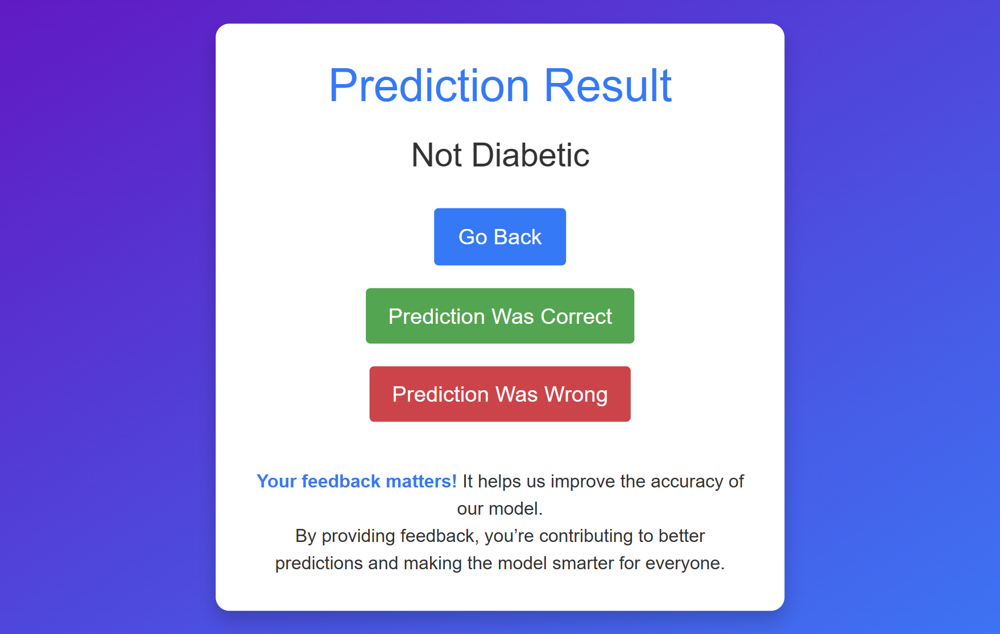
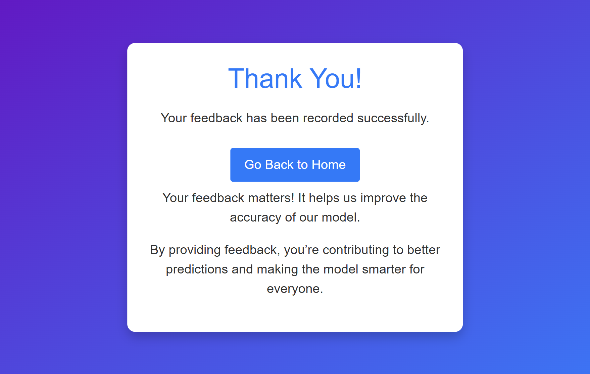

# Diabetes Prediction App 🌟

This is a **Machine Learning-powered web application** that predicts the likelihood of diabetes based on user input. Built with **Flask**, **MongoDB**, and **Heroku**, the app ensures an intuitive user experience while leveraging advanced analytics. 


---

## 🚀 Features

- **User-Friendly Interface**: Clean and responsive UI built with Bootstrap for ease of use.
- **Real-time Predictions**: Based on user input such as glucose levels, BMI, and more.
- **Data Validation**: Ensures inputs fall within a valid range to maintain prediction accuracy.
- **Feedback Collection**: Users can provide feedback on prediction accuracy, which is saved to MongoDB.
- **Deployed on Heroku**: Fast and reliable cloud-based deployment.

---

## 🌐 [Visit the Diabetes Prediction App](<https://dibeties-predictor-3915ef3dd74e.herokuapp.com/>)

---

## 📋 How It Works

1. **Input Your Data**: Enter your health metrics such as glucose level, blood pressure, BMI, etc.
2. **Prediction**: The app processes the inputs and predicts if the user is diabetic or not.
3. **Feedback**: Users can mark the prediction as "Correct" or "Incorrect," improving the app over time.

---

## 🛠️ Tech Stack

### Backend:
- Python (Flask) 🐍
- MongoDB (Feedback storage)
- Joblib (Model Serialization)

### Frontend:
- HTML5, CSS3
- Bootstrap 4
- FontAwesome Icons

### Deployment:
- Heroku (for cloud hosting)

---

## 🧑‍🔬 Machine Learning Model

The app uses a **Random Forest Classifier**, trained on the **PIMA Indians Diabetes Dataset**.

### Features Used:
- **Pregnancies**
- **Glucose Level**
- **Blood Pressure**
- **Skin Thickness**
- **Insulin**
- **BMI**
- **Diabetes Pedigree Function**
- **Age**

#### Preprocessing:
Inputs are standardized using **scikit-learn's StandardScaler** for better performance.

---

## 📂 Project Structure
<pre>
<code>
Diabetes-Predictor/
├── models/                    # Pre-trained models and scaler
│   ├── rf_model.pkl           # Pre-trained Random Forest model
│   └── rf_scaler.pkl          # Scaler for input normalization
├── templates/                 # HTML templates for the web app
│   ├── index.html             # Home page for data input
│   ├── result.html            # Displays prediction results
│   └── feedback.html          # Feedback form
├── Screenshots/               # Screenshots for documentation
│   ├── home_page_screenshot.png   # Screenshot of the Home Page
│   ├── result_page_screenshot.png # Screenshot of the Result Page
│   └── Feedback_page_screenshot.png # Screenshot of the Feedback Page
├── App.py                     # Flask application
├── Procfile                   # Heroku process file
├── requirements.txt           # Python dependencies
├── runtime.txt                # Python version for Heroku
├── README.md                  # Project documentation
└── training/                  # Folder for model training-related files
    ├── model_training.ipynb   # Jupyter Notebook for model training
    └── diabetes.csv           # Dataset used for training

</code>
</pre>

---

## ⚙️ Installation and Setup

Follow these steps to run the app locally or deploy it on Heroku:

### 1. Clone the Repository

```bash
git clone https://github.com/pratik1303/Diabetes-Predictor.git
cd Diabetes-Predictor
```
### 2. Install Dependencies
Make sure you have Python installed and then run:
```bash
pip install -r requirements.txt
```
### 3. Add Environment Variables
Create a .env file in the project root and add:
```bash
MONGO_URI=your-mongodb-uri
```
### 4. Run Locally
Start the app using:
```bash
python App.py
```
Visit http://localhost:5000 in your browser.
### 5. Deploy to Heroku
```bash
heroku create your-app-name
heroku git:remote -a your-app-name
git push heroku main
heroku open
```
## 📊 Input Ranges

The following table shows the valid ranges for each input field used by the diabetes prediction model:

| Field | Valid Range |
|---|---|
| Pregnancies | 0 - 20 |
| Glucose Level (mg/dL) | 0 - 200 |
| Blood Pressure (mmHg) | 0 - 140 |
| Skin Thickness (mm) | 0 - 99 |
| Insulin Level (μU/mL) | 0 - 900 |
| BMI (kg/m²) | 0 - 70 |
| Diabetes Pedigree Function | 0 - 2.5 |
| Age (years) | 0 - 110 |

## 📸 Screenshots
**Home Page:**



**Result Page:**



**Feedback Page:**



## 🙌 Contributing
Contributions are welcome! Please fork the repository, make your changes, and submit a pull request. 😊

## 🛡️ License
This project is licensed under the MIT License. See the LICENSE file for more details.

## 📞 Contact

If you have any questions or suggestions, feel free to reach out:

* Email: pratikchougle4@gmail.com
* GitHub: [pratik1303](https://github.com/pratik1303)


##  ✨ Important Notes ✨

Before running the application, please be sure to replace the following placeholders with your own information:

* **MongoDB URI:** Replace `your-mongodb-uri` in the `.env` file with your actual MongoDB connection string.
* **Heroku Deployment:** Replace `<YOUR_WEBSITE_LINK>` with the actual URL of your deployed app on Heroku.

Following these steps will ensure the application functions correctly and your contact information is accurate.

   
